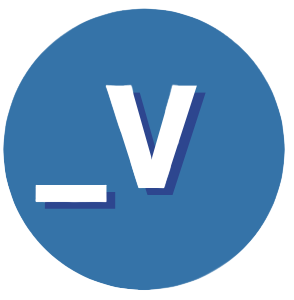
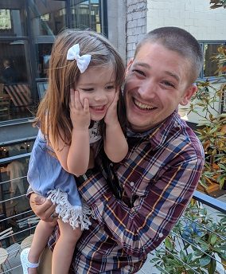
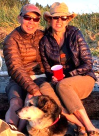
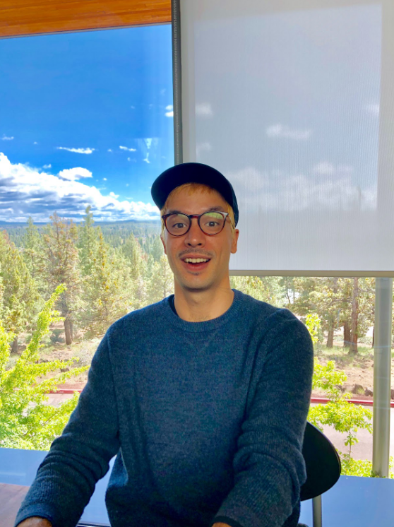

[cf-curriculum]: https://www.codefellows.org/learn-to-code/

[bds-curriculum]: https://www.cocc.edu/departments/continuinged/technology.aspx

# Vision
Coding is the new literacy, and our vision is to be the premium, go-to learning platform for beginners and pre-beginners in software development. We are educators passionate about coding and technology literacy for all.  

---
# Mission
We aim to provide high-quality content for those recently - or soon to be! - entering the field of software development. We want to equip those with the necessary knowledge and resources to understand **_what_** kind of software developer they want to be, and **_how_** to achieve that goal.

---
# Authors

## Adam DuQuette

Hello. My name is Adam DuQuette. I am a Developer Learning Engineer at TechSoft 3D and obtained a Bachelor of Science in Applied Computer Science from Oregon State University Cascades (OSU-Cascades). I live a laid back life with my family, dog, and the Portland Timbers always on my mind. 

I have been fortunate enough to teach Computer Architecture and Assembly Programming Languages at my alam mater, OSU-Cascades. As well, I helped launch a coding bootcamp at Central Oregon Community College as the Lead Instructor, while being a close partner with the Central Oregon branch of Apprenti. During this time I was the Lead Instructor to [Code Fellows][cf-curriculum] courses including: **Code 101**, **201**, **301**, and **401-Advanced JavaScript**.

I want Vulcan Code Academy to be successful because I remember how confusing and chaotic my first steps into software development were. I did not know where to look, or what or who to trust. I hope my experiences, along with my passion for training and education, allow me to ease some of that same confusion and chaos you might be experiencing right now! I'm glad you are here.

Live. Code. Prosper. **_V**

## Calvin Cheng

Prior to the 2001 Dotcom crash, Calvin worked as a Technical Facilitator, teaching web technologies, VB, OOAD, and UML at the Information Technology Institute; a now defunct, but quite innovative and ahead-of-its-time bootcamp-style school. He was educated as a Chemical Engineer from the University of British Columbia, but never actually worked in that field. 

Fast-forward 18 years, and with various roles in technology, including a combined 10-year stint at Amazon, managing an analytics platform for the office of finance - he realized what he loved most about technology was sharing it, teaching it and being the catalyst for people to see and experience its potential in their life. While most of his past 18 years have been focused on business intelligence, and data warehousing, Calvin’s technological interests have come full circle in recent years with an emphasis on modern web development. 

Calvin has an insatiable curiosity for how things work, whether it is technology, people, sports or why he is the only one in his household who knows how to work the TV remotes. In his spare time, he and his wife love all that Central Oregon has to offer outdoors, as well as the warm and wonderful people who live here. If you have a few hours to spare, ask him about drone racing and how he was a part of a championship race team in 2018.

Live. Code. Prosper. **_V**

## Nathaniel Pierce

Originally from Portland, Oregon, Nathan has lived all over the United States. His grandfather served as a sergeant in the U.S. Army, and passed on the proclivity for frequent travel and relocation. This has afforded him the opportunity to see and meet people from all over the country and walks of life. As a result, his interests are as wide and varied as his experiences; from illustrative art, to music, poetry, sewing, woodworking and permaculture, to antique auto repair, economics, information technology, social psychology, film, skateboarding and much… much… more. In his words, "The common denominator in all of these activities is connection". 

This diverse set of interactions and interests has helped him become a keen observer, effective communicator, learner and teacher. He is currently a junior in the Faculty of Computer Science at OSU-Cascades and works as a Teaching Assistant at [Bend DevStation][bds-curriculum] - a software programming school powered by [Code Fellows][cf-curriculum]. Of particular interest to him is Free and Open Source Software, and its influence on the market-based production of industrial economies, as well as exploring software as a medium for social experimentation and creative expression. 

Live. Code. Prosper. **_V**
